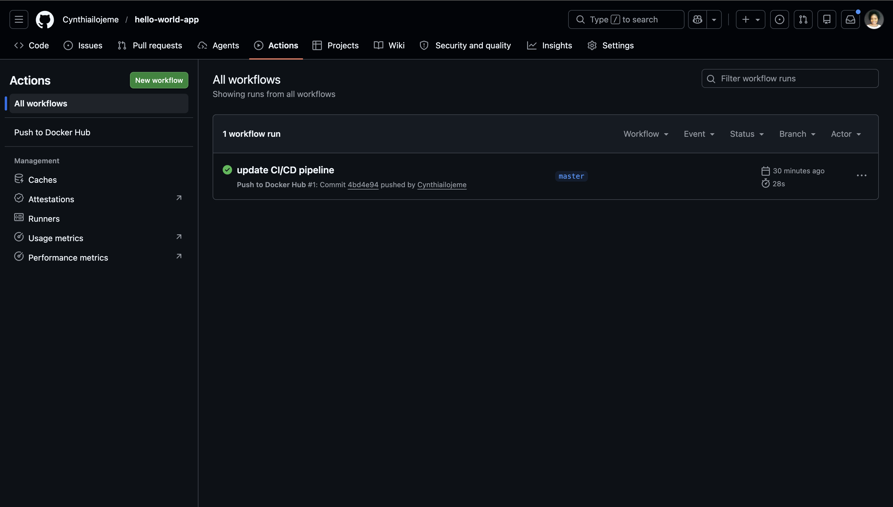
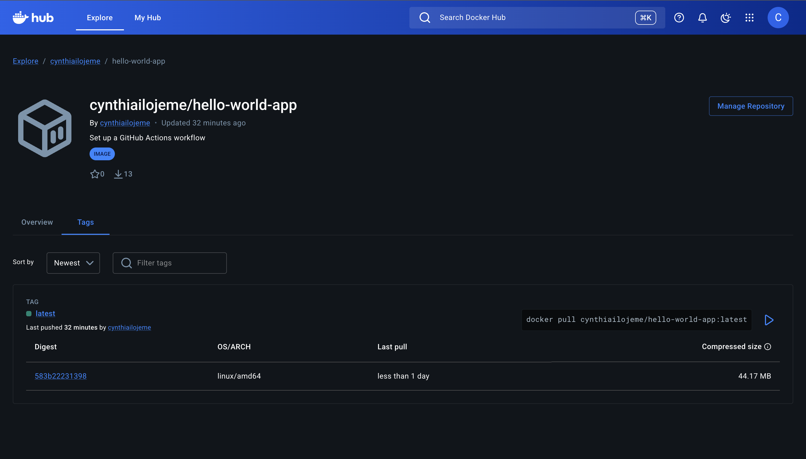

# Hello World App

## Steps Taken

### 1. Created the App
Built a simple Node.js + Express app that returns "Hello World!" on port 3000.

### 2. Containerized with Docker
Wrote a Dockerfile using `node:18-alpine` as the base image.

### 3. CI/CD Pipeline
Set up a GitHub Actions workflow that automatically builds and pushes the Docker image to Docker Hub on every push to main.

## Docker Hub
🔗 https://hub.docker.com/r/cynthiailojeme/hello-world-app

## Screenshots

