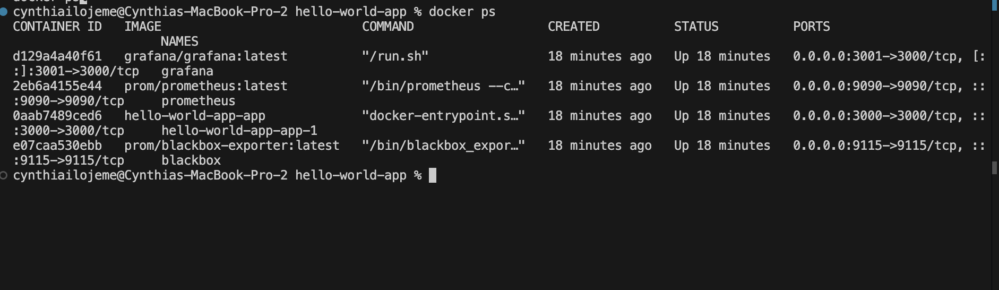
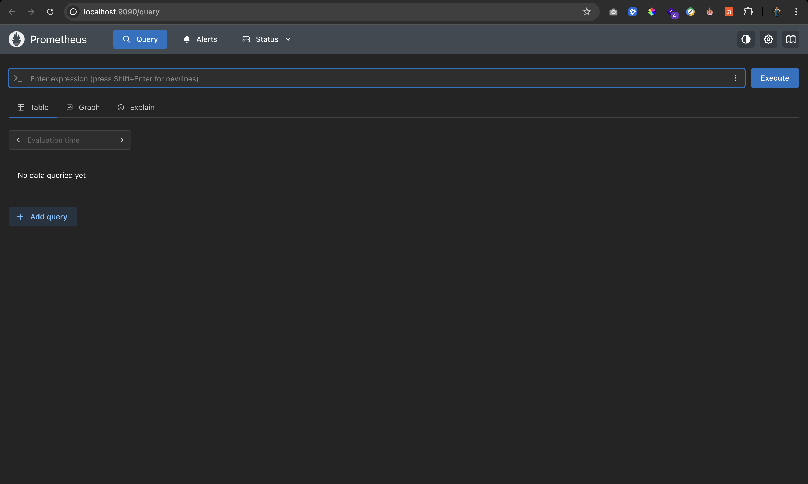
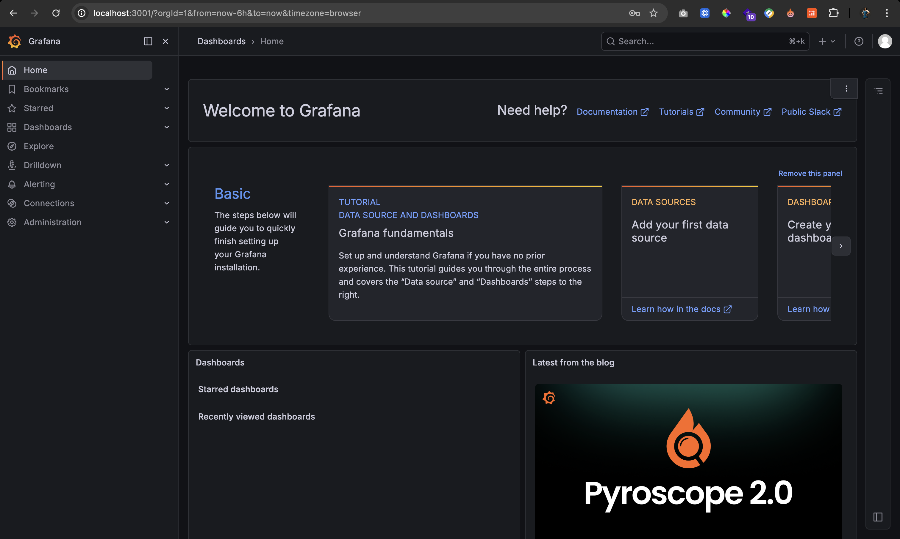

# Hello World App — Monitoring Setup

## Overview
This branch (`monitoring`) extends the Hello World application by introducing a full monitoring stack using **Prometheus**, **Blackbox Exporter**, and **Grafana**. These tools work together to collect, probe, and visualize metrics from the running application.

---

## Task Description
In this task, the existing `docker-compose.yml` was updated to include three additional monitoring services alongside the Hello World app:
- **Prometheus** — collects and stores metrics
- **Blackbox Exporter** — probes the app's HTTP endpoint to check availability
- **Grafana** — visualizes the collected metrics through dashboards

---

## Project Structure
```bash
hello-world-app/
├── .github/
│   └── workflows/
│       └── docker-push.yml
├── screenshots/
├── index.js
├── Dockerfile
├── docker-compose.yml
├── prometheus.yml
├── package.json
├── .gitignore
└── README.md
```
---

## Services

### 1. Hello World App (port 3000)
A simple Node.js + Express application that returns "Hello World!" on the root endpoint. This is the application being monitored.

### 2. Prometheus (port 9090)
Prometheus is an open-source monitoring and alerting toolkit. It scrapes metrics from configured targets at regular intervals and stores them as time-series data.

In this setup, Prometheus:
- Scrapes itself every 15 seconds
- Uses Blackbox Exporter to probe the Hello World app's HTTP endpoint

Configuration file: `prometheus.yml`

### 3. Blackbox Exporter (port 9115)
The Blackbox Exporter allows Prometheus to probe endpoints over HTTP, HTTPS, DNS, TCP and ICMP. In this setup it probes the Hello World app on `http://app:3000` and reports whether the endpoint is up and responding with a 2xx status code.

### 4. Grafana (port 3001)
Grafana is an open-source analytics and visualization platform. It connects to Prometheus as a data source and displays the collected metrics in customizable dashboards.

Default login credentials:
- Username: `admin`
- Password: `admin`

---

## Setup & Installation

### Prerequisites
Make sure you have the following installed:
- [Docker](https://docs.docker.com/get-docker/)
- [Docker Compose](https://docs.docker.com/compose/install/)

### Clone the Repository
```bash
git clone https://github.com/Cynthiailojeme/hello-world-app.git
cd hello-world-app
git checkout monitoring
```

### Run the Application
```bash
docker-compose up --build
```

This will start all four containers. You should see logs from each service in your terminal.

### Access the Services
Once all containers are running, open these URLs in your browser:

| Service | URL | Description |
|---|---|---|
| Hello World App | http://localhost:3000 | The main application |
| Prometheus | http://localhost:9090 | Metrics dashboard |
| Blackbox Exporter | http://localhost:9115 | Endpoint probe status |
| Grafana | http://localhost:3001 | Visualization dashboard |

### Verify Running Containers
To confirm all containers are running:
```bash
docker ps
```

You should see four containers running:

| Container | Port | Status |
|---|---|---|
| app | 3000 | Up |
| prometheus | 9090 | Up |
| blackbox | 9115 | Up |
| grafana | 3001 | Up |

### Stop the Application
```bash
docker-compose down
```

---

## How the Monitoring Stack Works
1. The **Hello World app** runs and serves traffic on port 3000
2. **Blackbox Exporter** continuously probes `http://app:3000` to check if it is up and returning a successful HTTP response
3. **Prometheus** scrapes Blackbox every 15 seconds and stores the probe results as metrics
4. **Grafana** connects to Prometheus and displays those metrics visually on a dashboard

---

## Screenshots


